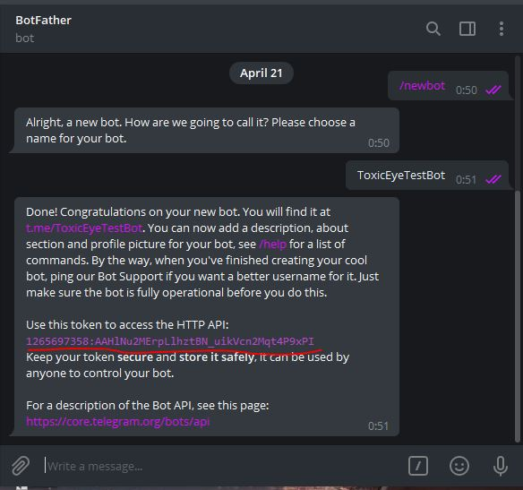
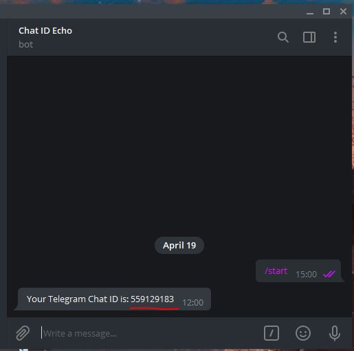
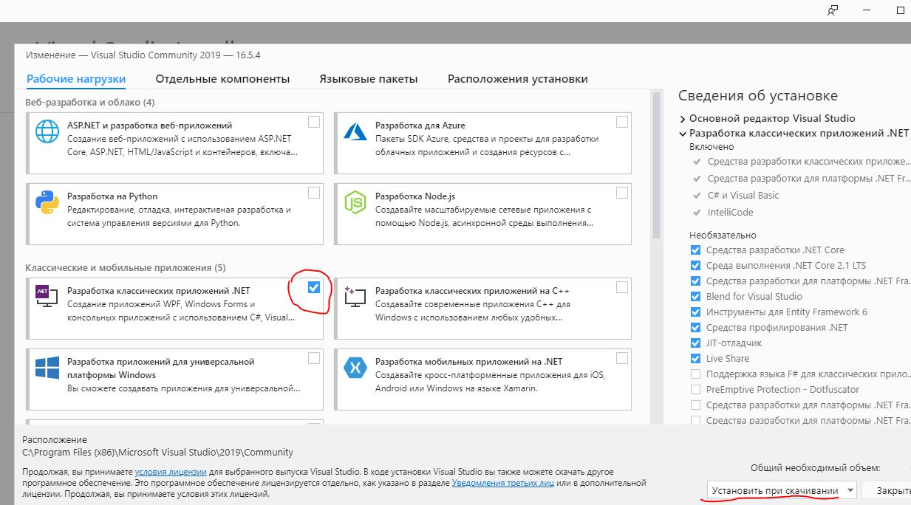
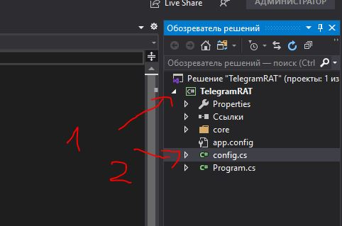
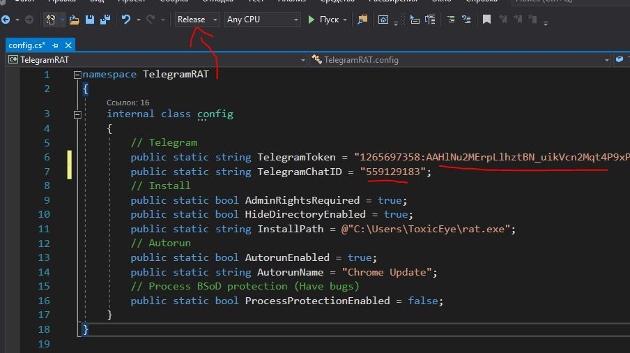
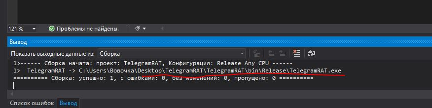
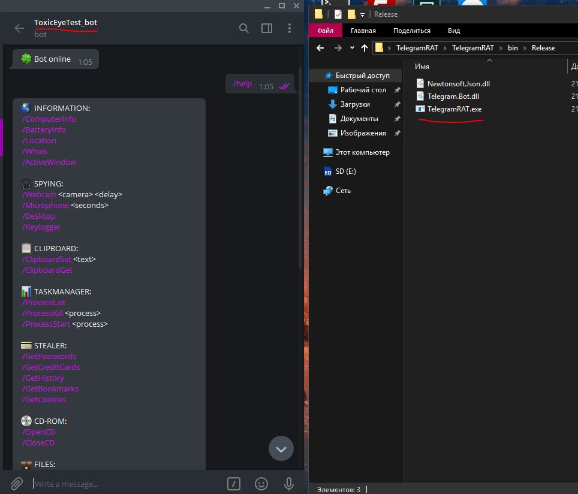

# :trident: ToxicEye 
Program for remote control of Windows computers via Telegram bot. Written in C#.

  

# :fallen_leaf: Functions:

| **System Information**    | **Devices**         | **Clipboard**      | **Processes**         |
|---------------------------|---------------------|--------------------|-----------------------|
| ComputerInfo              | Webcam              | ClipboardSet       | ProcessList           |
| BatteryInfo               | Microphone          | ClipboardGet       | ProcessKill           |
| Location                  | OpenCD              |                    | ProcessStart          |
| Whois                     | CloseCD             |                    | TaskManagerDisable    |
| ActiveWindow              |                     |                    | TaskManagerEnable     |
| Desktop                   |                     |                    | MinimizeAllWindows    |
| GetPasswords              |                     |                    | MaximizeAllWindows    |
| GetCreditCards            |                     |                    |                       |
| GetHistory                |                     |                    |                       |
| GetBookmarks              |                     |                    |                       |
| GetCookies                |                     |                    |                       |
| GetDesktop                |                     |                    |                       |

| **Files and Directories** | **Applications and Platforms** | **Network**        | **Download and Upload** |
|---------------------------|--------------------------------|--------------------|-------------------------|
| ListFiles                 | GetFileZilla                   | NetDiscover        | DownloadFile            |
| RemoveFile                | GetDiscord                     |                    | UploadFile              |
| RemoveDir                 | GetTelegram                    |                    |                         |
| MoveFile                  | GetSteam                       |                    |                         |
| MoveDir                   |                                |                    |                         |
| CopyFile                  |                                |                    |                         |
| CopyDir                   |                                |                    |                         |
| EncryptFileSystem         |                                |                    |                         |
| DecryptFileSystem         |                                |                    |                         |

| **Running Files**         | **Audio**         | **Display and Input** | **System**         | **Others**  |
|---------------------------|-------------------|-----------------------|--------------------|-------------|
| RunFile                   | AudioVolumeSet    | SetWallPaper          | Shell              | Speak       |
| RunFileAdmin              | AudioVolumeGet    | BlockInput            | MessageBox         | Help        |
|                           |                   | Monitor(off/on)       | OpenURL            | About       |
|                           |                   | DisplayRotate         | SendKeyPress       | Uninstall   |
|                           |                   |                       | ForkBomb           |             |
|                           |                   |                       | BsoD               |             |
|                           |                   |                       | OverwriteBootSector|             |
|                           |                   |                       | Shutdown           |             |
|                           |                   |                       | Reboot             |             |
|                           |                   |                       | Hibernate          |             |
|                           |                   |                       | Logoff             |             |

# :hammer: Compiling Guide:

1. Go to the [@BotFather](https://t.me/BotFather) bot and create your own bot. You need to save the token and bot name.  
   

2. Now you need to get your chat ID. To do this, go to the next bot [@chatid_echo_bot](https://t.me/chatid_echo_bot) and save the ID.  
   

3. Download [Visual Studio 2019](https://visualstudio.microsoft.com/en/vs/)  
   

4. Download the [source code](https://codeload.github.com/LimerBoy/ToxicEye/zip/master) of this program.  
   

5. Unzip the “Telegram RAT” folder to your desktop.

6. Open the `TelegramRAT.sln` file through Visual Studio.

7. Open the `config.cs` file in the project.  
   

8. Insert your token from the bot and your chat ID that you received earlier.

9. Above, you need to select ”Release”.  
   

10. Press `CTRL + S` to save and `CTRL + B` to compile everything into an executable file.  
    

11. You can send the received file to someone.

12. After starting the file, you can control the computer through the bot.  
    

13. Write `/help` to see all available commands.

Original Code Owner: [Imperator Vladimir](https://github.com/LimerBoy)
